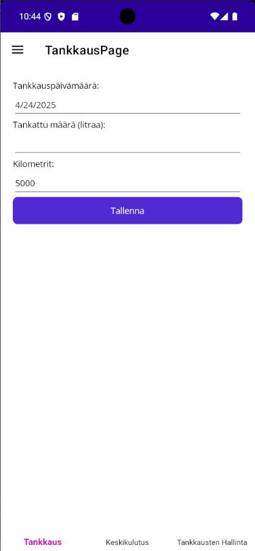

AutonHuoltoSovellus

AutonHuoltoSovellus on .NET MAUI -sovellus, jolla voit seurata ajoneuvosi tankkauksia ja laskea keskikulutuksen kuukausitasolla. Sovellus toimii Androidilla ja Windowsilla, ja se on rakennettu helposti laajennettavaksi.

🔧 Ominaisuudet

    ✅ Tankkausten tallennus: päivämäärä, litrat, kilometrit

    ✅ Keskikulutuksen laskenta kuukausittain (litraa / 100 km)

    ✅ Tallennettujen tankkausten katselu ja yksittäinen/kaikki poistaminen

    ✅ Oletusarvona edellinen kilometrilukema

    ✅ Toimenpidetiedote tallennuksen jälkeen (Snackbar)

📊 Teknologia

Osa             Teknologia

Sovelluskehys   .NET MAUI

Kieli           C#

Tietokanta      SQLite + Entity Framework Core

UI              XAML

IDE             Visual Studio 2022

Lisäkirjasto    CommunityToolkit.Maui (Snackbareihin)

🗂️ Tietorakenne

Tankkaus-tietue sisältää:

    Aika (DateTime)

    Litrat (double)

    Kilometrit (double)

Tieto tallennetaan laitteen sisäiseen SQLite-tietokantaan kansiossa FileSystem.AppDataDirectory.

📱 Alustat

    Android (testattu emulaattorilla)

    Windows 10/11

📸 Näyttökuva sovelluksesta

✨ Tulevia parannuksia

    CSV/JSON-vienti

    Graafinen pylväskaavio kulutuksesta

    Tankkausten haku ja suodatus

    Pilvipalvelusynkronointi (esim. Firebase, Azure)

🔗 Riippuvuudet

Asennettavat NuGet-paketit:

    CommunityToolkit.Maui
    Microsoft.EntityFrameworkCore.Sqlite

Muista myös lisätä UseMauiCommunityToolkit() metodiin MauiProgram.cs:

    builder
        .UseMauiApp<App>()
        .UseMauiCommunityToolkit();

💼 Kehittäjä

Sovelluksen kehitti ohjelmistokehittäjäopiskelija (2025).